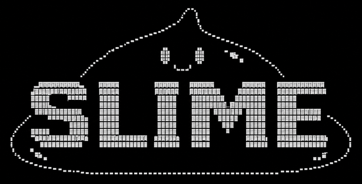

<div align="center">
  

  # 👾 Slime - 勇者最佳的 AI Agent

  **史莱姆会随着你的沟通越来越接近你预期的形态，史莱姆易塑且持久，勇者请跟着你的史莱姆一起踏上征程吧**
</div>

## Quick Start

```bash
npm install
npm run build
```

Start the default interactive chat:

```bash
node dist/index.js
```

Common commands:

```bash
node dist/index.js chat
node dist/index.js config
node dist/index.js dashboard
node dist/index.js skill list
```

## Configuration

Copy `.env.example` to `.env`, then fill in your provider settings and channel credentials as needed.

Local user config is written to:

```bash
~/.slime/config.json
```

If the home directory is not writable, Slime falls back to:

```bash
.slime/config.json
```

## Providers

Built-in provider names:

- `openai`
- `anthropic`
- `deepseek`
- `minimax`

DeepSeek example:

```env
GAUZ_LLM_PROVIDER=deepseek
GAUZ_LLM_API_KEY=your_key
GAUZ_LLM_API_BASE=https://api.deepseek.com/v1
GAUZ_LLM_MODEL=deepseek-chat
```

MiniMax example:

```env
GAUZ_LLM_PROVIDER=minimax
GAUZ_LLM_API_KEY=your_key
GAUZ_LLM_API_BASE=https://api.minimaxi.com/v1
GAUZ_LLM_MODEL=MiniMax-M2.7
```

## More Docs

- Command reference: [docs/COMMANDS.md](docs/COMMANDS.md)
